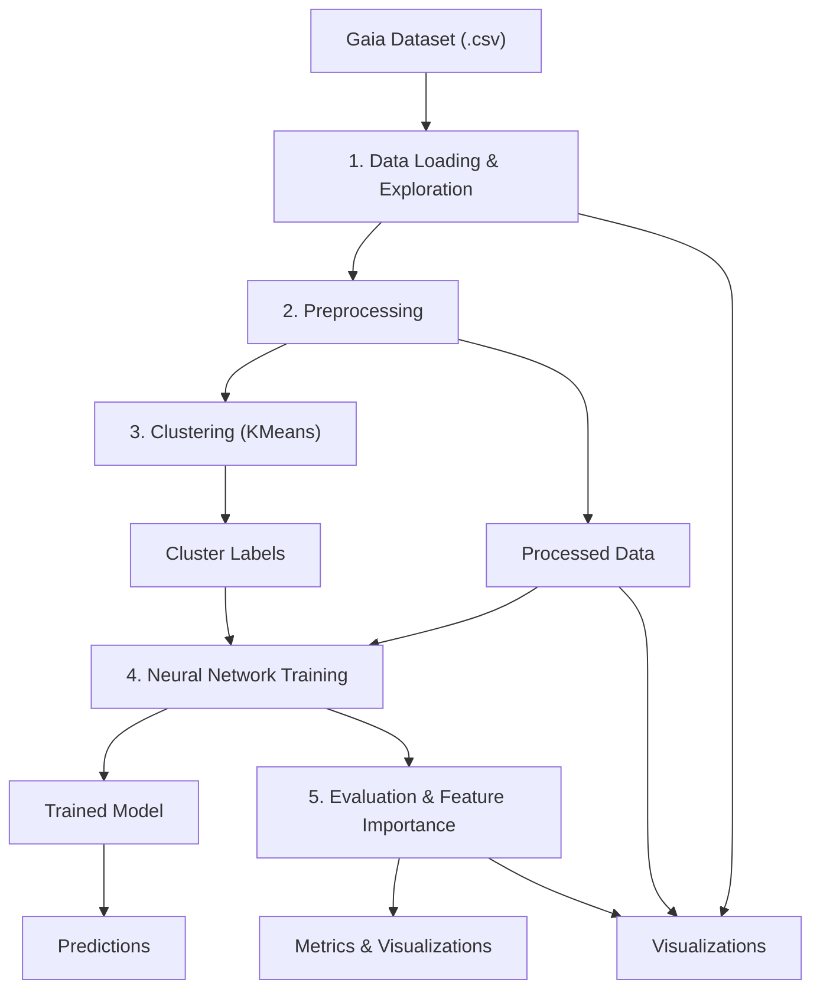

# Neural Network Approach to Stellar Classification Using Gaia Astrometric Data

<!-- Row 1 -->
<p float="left">
  
  

</p>

<!-- Row 2 -->
<p float="left">
  
  


</p>

##  Dataset

- Source: [GAIA Sky Datasets](https://gaiasky.space/resources/datasets/)

The Star Classification Project processes the Gaia dataset to categorize stars into Main Sequence, Giants, and White Dwarfs using a machine learning pipeline centered on an Artificial Neural Network (ANN) model. The workflow involves loading and exploring the dataset, preprocessing features (e.g., Teff, Radius, Mass) through cleaning, outlier removal, and standardization, and applying KMeans clustering to generate initial labels. A fully connected ANN (StarClassifier) with 18 input features, four hidden layers (256, 128, 64, 32 units), and a 3-unit output layer is trained using cross-entropy loss and the Adam optimizer to classify star types. The pipeline evaluates model performance with accuracy and confusion matrices and assesses feature importance via permutation. The system enables predictions for new stars, leveraging astrophysical features to achieve robust classification, suitable for astronomical research and analysis.



#  Clone the repo

```
git clone https://github.com/say217/GAIA-Classifier-ANN-model.git
cd GAIA-Classifier-ANN-model
```
